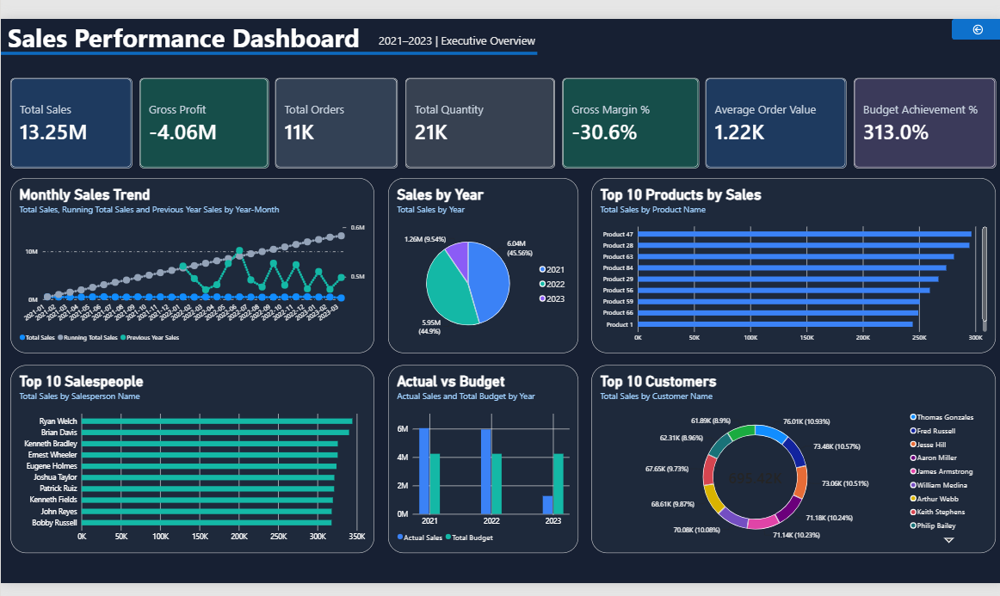
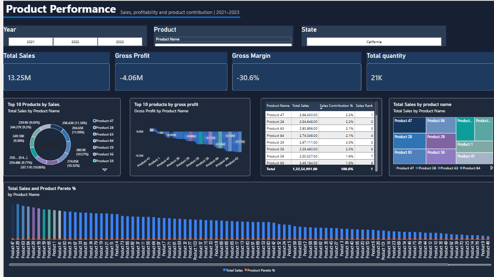
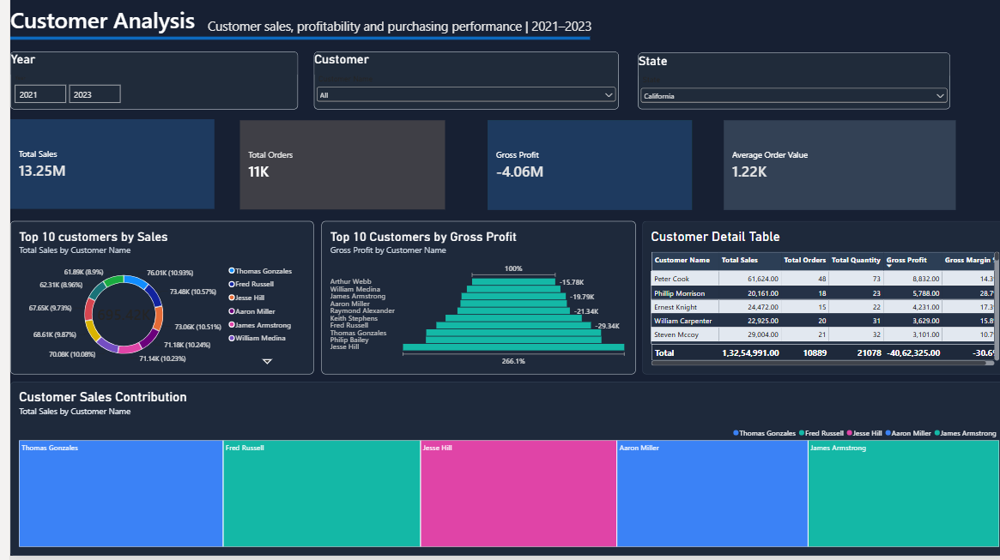
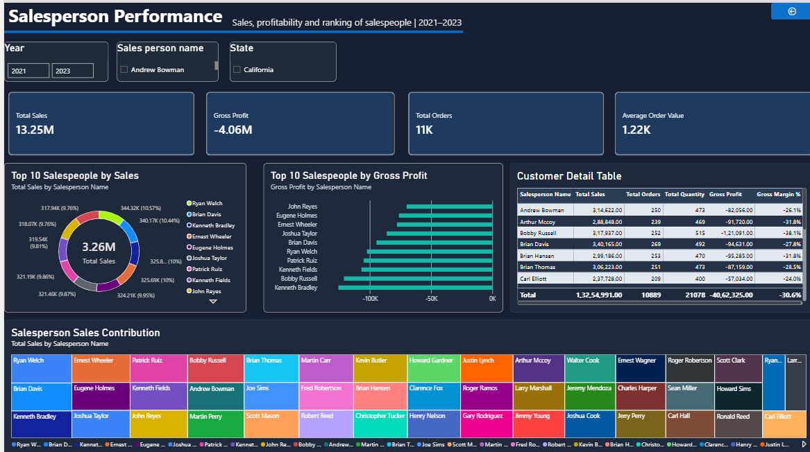
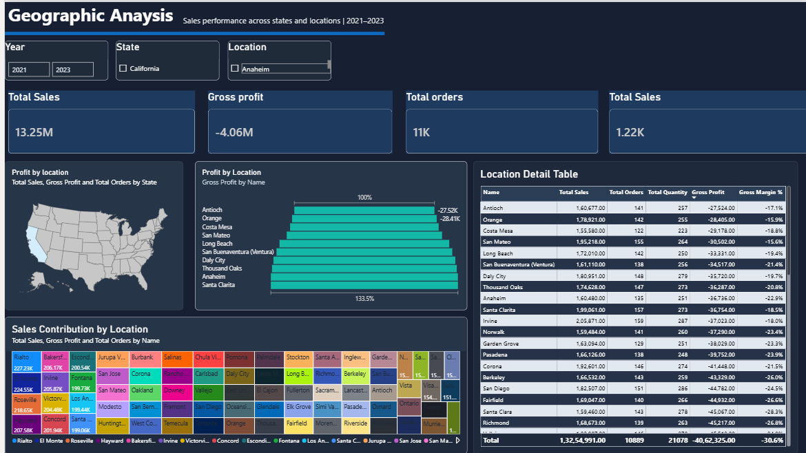
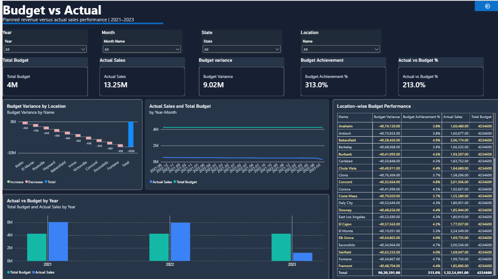

# Sales Intelligence Dashboard – Power BI

## 📊 Project Overview

This project presents an interactive Sales Intelligence Dashboard developed using Microsoft Power BI.

The dashboard analyzes three years of retail sales data (2021–2023) to provide insights into sales performance, profitability, products, customers, salespeople, geography, and budget performance.

## 🎯 Business Objective

The objective is to transform raw retail sales data into an interactive business intelligence solution that helps management:

- Monitor overall sales and profitability
- Analyze year-over-year performance
- Identify high-performing products and customers
- Evaluate salesperson performance
- Analyze geographic sales performance
- Compare actual sales against budget
- Identify business problems and growth opportunities

## 🛠️ Tools & Technologies

- Microsoft Power BI
- Power Query
- DAX
- Excel
- Data Modeling
- Star Schema

## 🗂️ Dashboard Pages

### 1. Executive Overview

Provides a high-level view of sales, profit, orders, quantity, margins, budget achievement, and year-over-year performance.

### 2. Sales Trend Analysis

Analyzes monthly, quarterly, yearly, and year-over-year sales trends.

### 3. Product Performance

Analyzes product sales, quantity, cost, profitability, margins, contribution, and Pareto performance.

### 4. Customer Analysis

Analyzes customer sales, orders, purchasing behavior, profitability, and contribution.

### 5. Salesperson Performance

Compares salespeople based on sales, orders, quantity, profit, and performance.

### 6. Geographic Analysis

Analyzes sales and profitability across states and locations.

### 7. Budget vs Actual

Compares planned budget with actual sales and highlights budget variance and achievement.

## 🧩 Data Model

The report uses a star-schema approach consisting of:

- Fact_Sales
- Dim_Date
- Product_Data
- Location_Data
- Customer_Data
- Salespeople_Data
- Budget_Data

## 📐 Key DAX Measures

Some important measures include:

- Total Sales
- Total Orders
- Total Quantity
- Average Order Value
- Total Cost
- Gross Profit
- Gross Margin %
- YoY Sales Growth
- YoY Growth %
- MTD Sales
- YTD Sales
- Budget Variance
- Budget Achievement %
- Actual vs Budget %
- Running Total Sales
- 3 Month Moving Average
- Sales Rank
- Sales Contribution %
- Product Pareto %

## 🔍 Key Business Insights

- Total sales across the analyzed period were approximately 13.25M.
- Overall profitability requires attention, with negative gross profit in the current calculation.
- 2021 was the strongest year by sales.
- Several products generate strong revenue but have weak or negative margins.
- Sales performance varies significantly across locations.
- Budget performance shows both high-achieving and underperforming locations.

## 💡 Recommendations

1. Review pricing and cost structures for low-margin products.
2. Focus on high-performing products and locations.
3. Investigate underperforming locations and customers.
4. Monitor year-over-year sales decline and identify its causes.
5. Improve budget allocation based on actual location and time-based performance.

## 📁 Project Files

- `Sales_Dashboards_Madhu.pbix` – Power BI dashboard
- `screenshots/` – Dashboard page screenshots
- `README.md` – Project documentation
